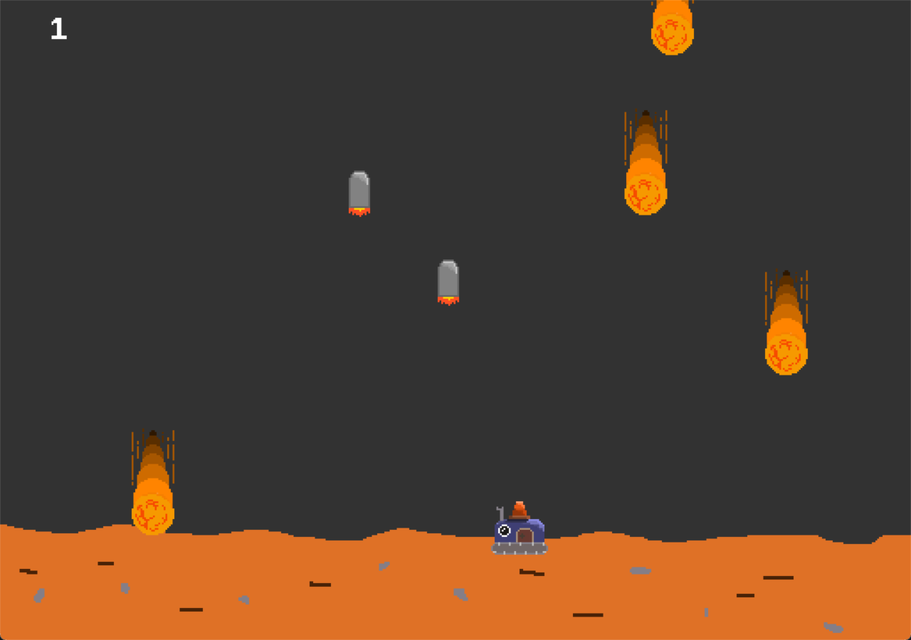

# GECS

`gecs` 是一个参考了[EnTT](https://github.com/skypjack/entt)源码结构，和[Bevy-ECS](https://bevyengine.org/)API的用于游戏开发的ECS系统。采用C++17。

## 使用方法

`demo`下有一个完整的例子

### 基本例子

`gecs`的API大量借鉴了`bevy`游戏引擎，下面是一个简单例子：

```cpp
// 包含头文件
#include "gecs/gecs.hpp"

using namespace gecs;

// 一个component类型
struct Name {
    std::string name;
};

// 一个resource类型
struct Res {
    int value;
};

// 每帧都会更新的system
void update_system(commands cmds, querier<Name> querier, resource<Res> res) {
    for (auto& [_, name] : querier) {
        std::cout << name.name << std::endl;
    }

    std::cout << res->value << std::endl;
}

int main() {
    world world;

    // 得到Lambda对应的函数指针
    constexpr auto startup = +[](commands cmds) {
        auto entity1 = cmds.create();
        cmds.emplace<Name>(entity1, Name{"ent1"});
        auto entity2 = cmds.create();
        cmds.emplace<Name>(entity2, Name{"ent2"});

        cmds.emplace_resource<Res>(Res{123});
    };

    // 注册这个函数指针
    world.regist_startup_system<startup>();

    // 使用普通函数
    world.regist_update_system<update_system>();
    // 使用函数指针也可
    // world.regist_update_system<&update_system>();

    world.startup();
    world.update();

    return 0;
}
```

### world

`world` 是整个ECS的核心类，管理几乎所有ECS数据。

使用默认构造函数创建一个即可：

```cpp
gecs::world world;
```

一个典型的ECS程序一般如下：

```cpp
// 创建world
gecs::world world;

// 注册startup system
world.regist_starup_system<your_startup_system1>();
world.regist_starup_system<your_startup_system2>();
...

// 注册update system 
world.regist_update_system<your_update_system1>();
world.regist_update_system<your_update_system2>();
...

// 启动ECS
world.startup();

// 游戏循环中每帧更新ECS
while (shouldClose()) {
    world.update();
}
```

### system

`system`分为两种：
* `startup system`：在启动时执行一次，主要用于初始化数据
* `update system`：每帧运行一次

`system`**不是**`std::function`类型，而是普通函数类型。所以若想使用lambda，则不能有任何捕获。

`system`没有固定的函数声明，但只能包含零个或多个`querier`/`resource`/`commands`。参数顺序没有要求。

`startup system`使用`regist_startup_system`即可注册：

```cpp
world.regist_startup_system<your_startup_system>();
```

`update system`使用`regist_update_system`即可注册:

```cpp
// 使用lambda，无捕获的lambda会被转换为普通函数，在lambda前面加`+`可以获得对应函数类型
// 含有两个querier和一个resource
world.regist_update_system<+[](querier<Name> q1, querier<Family> q2, resource<FamilyBook> res)>();
// 含有一个commands和一个q1
world.regist_update_system<+[](commands cmd, querier<Name> q1)>();
```

### querier和resource

#### querier

`querier`用于从`world`中查询拥有某种组件的实体，一般作为`system`的参数：

```cpp
// q1查询所有含有Name实体的组件，q2查询所有函数Family实体的组件。并且Name组件不可变，Family可变
void update_system(querier<Name> q1, querier<mut<Family>> q2) { ... }
```

只有使用`mut<T>`模板包裹组件类型时，才能够得到可变组件。这是为了之后对各个系统进行并行执行打下基础。

可以直接遍历`querier`来得到所有实体和对应组件：

```cpp
for (auto& [entity, name] : q1) {
    ...
}

// 组件很多时按querier类型中声明的顺序得到
for (auto& [entity, comp1, comp2, comp3] : multi_queirer) {
    ...
}
```

可以使用一些条件来进行查询：

* `only<Ts...>`：要求实体只能拥有指定的组件，使用此条件时不能有其他参数：
    ```cpp
    void update_system(querier<only<Comp1, Comp2>> q); // 会查询所有只含有Comp1, Comp2的组件

    void update_system(querier<Comp1, only<Comp2, Comp3>>); // 非法！only只能单独存在且只有一个
    ```
* `without<T>`：要求实体不能拥有此组件，语句中只能有一个`without`，并且语句中必须含有其他的无条件查询类型：
    ```cpp
    void system(querier<Comp1, without<Comp2>>);    //查询所有含有Comp1但不含有Comp2的组件
    void system(querier<Comp1, without<Comp2, Comp3>>); // 查询所有含Comp1，但不含有Comp2和Comp3的组件

    void system(querier<without<Comp2>>);   // 非法！必须含有至少一个无查询条件的类型
    ```

#### resource

`resource`则是对资源的获取。资源是一种在ECS中唯一的组件：

```cpp
void system(resource<Name> res) {
    // 通过operator->直接获得。不存在资源会导致程序崩溃！
    res->name = "ent";
}
```

### commands

`commands`是用于向`world`中添加/删除实体/组件/资源的类：

```cpp
void system(commands cmds) {
    // 创建entity
    auto entity = cmds.create();
    // 附加组件到实体
    cmds.emplace<Name>(entity, Name{"ent"});

    // 从实体上删除组件
    cmds.remove<Name>(entity);

    // 删除实体及其所有组件
    cmds.destroy(entity);

    // 设置资源
    cmds.emplace_resource<Res>(Res{});

    // 移除并释放资源
    cmds.remove_resource<Res>();
}
```

有些组件必须一起创建才能正常工作，而`Bundle`可以一次性创建多个组件以防遗忘：
`Bundle`不是一个具体类，而是用户自定义的POD类。类中的所有成员变量会被作为component附加在entity上：

```cpp
struct Comp1 {};
struct Comp2 {};

// 定义一个bundle
struct CompBundle {
    Comp1 comp1;
    Comp2 comp2;
};

// in main():
cmds.emplace_bundle<CompBundle>(entity, CompBundle{...});
```

创建之后`entity`将会拥有`Comp1`和`Comp2`两个组件。

### signal系统

signal类似于Qt的信号槽或Godot的signal。用于更好地实现观察者模式。

在`system`声明中，可以使用`event_dispatcher<T>`来注册/触发/缓存一个T类型事件：

```cpp
void Startup(gecs::commands cmds, gecs::event_dispatcher<SDL_QuitEvent> quit,
             gecs::event_dispatcher<SDL_KeyboardEvent> keyboard);
```

`event_dispatcher`可以链接多个回调函数，以便于在事件触发时自动调用此函数：

```cpp
constexpr auto f = +[](const SDL_QuitEvent& event,
                        gecs::resource<gecs::mut<GameContext>> ctx) {
    ctx->shouldClose = true;
};

// 使用sink()函数获得信号槽，然后增加一个函数
quit.sink().add<f>();
```

函数会按照加入的顺序被调用。

函数的声明和`system`一样，只是第一个参数必须是事件类型`T`相关的`const T&`。

删除事件回调函数也是通过信号槽删除，这里不再演示。

想要缓存新事件，可以使用`enqueue()`函数:

```cpp
void EventDispatcher(gecs::resource<gecs::mut<GameContext>> ctx,
                     gecs::event_dispatcher<SDL_QuitEvent> quit,
                     gecs::event_dispatcher<SDL_KeyboardEvent> keyboard) {
    while (SDL_PollEvent(&ctx->event)) {
        if (ctx->event.type == SDL_QUIT) {
            // 放入一个SDL_QuitEvent
            quit.enqueue(ctx->event.quit);
        }
        if (ctx->event.type == SDL_KEYDOWN || ctx->event.type == SDL_KEYUP) {
            // 放入一个SDL_KeyboardEvent
            keyboard.enqueue(ctx->event.key);
        }
    }
}
```

缓存的事件会被放在缓存列表里，可以被一次性全部触发：

```cpp
quit.trigger_cached();

// 如果有必要，触发完不要忘了删除所有缓存事件
quit.clear_cache();

// 或者，也可以调用update()自动做上面两个事情
quit.update();
```

如果不触发，在`world.update()`的最后（所有`update system`调用后）会自动触发所有事件并删除。

如果想要立刻触发，使用：

```cpp
quit.trigger(YourQuitEvent);
```

来触发。

### Demo

为了测试ECS的稳定性，编写了一个Demo。默认是不编译的，需要SDL2库。请在根目录下运行。

